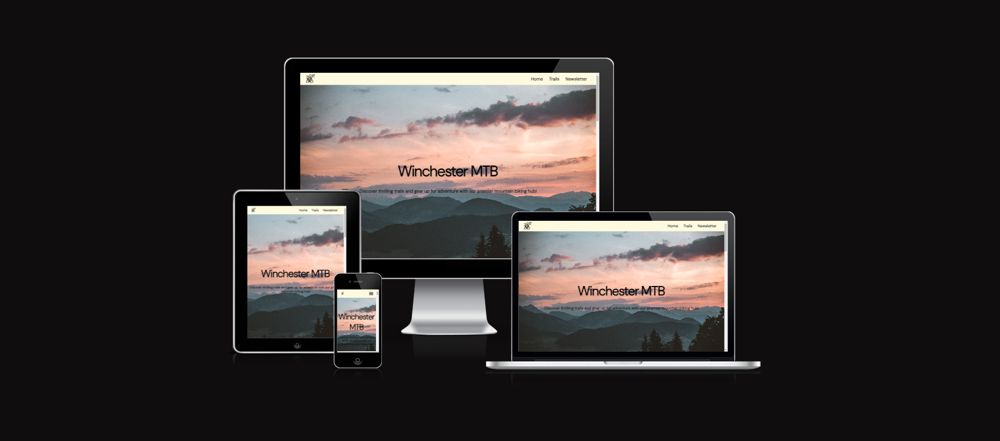

Winchester Mountain Bike Club 

Winchester mountain bike club is a page designed to be a responsive and intuitive site that allows users to view different styles of riding and local trails to the south of England. 

](assets/docs/wireframes/image.png)

https://bluiss.github.io/winchester-bike-club/index.html

---

## CONTENTS

* [User Experience](#user-experience-ux)
  * [User Stories](#user-stories)

* [Design](#design)
  * [Colour Scheme](#colour-scheme)
  * [Typography](#typography)
  * [Imagery](#imagery)
  * [Wireframes](#wireframes)

* [Features](#features)
  * [General Features on Each Page](#general-features-on-each-page)
  * [Future Implementations](#future-implementations)
  * [Accessibility](#accessibility)

* [Technologies Used](#technologies-used)
  * [Languages Used](#languages-used)
  * [Frameworks, Libraries & Programs Used](#frameworks-libraries--programs-used)

* [Deployment & Local Development](#deployment--local-development)
  * [Deployment](#deployment)
  * [Local Development](#local-development)
    * [How to Fork](#how-to-fork)
    * [How to Clone](#how-to-clone)

* [Testing](#testing)

* [Credits](#credits)
  * [Code Used](#code-used)
  * [Content](#content)
  * [Media](#media)
  * [Acknowledgments](#acknowledgments)

---

## User Experience (UX)

👩🏻‍💻 Initial Discussion
Winchester Mountain Bike Club (WMTB) is an online site dedicated to the various biking disciplines and trails surrounding the south of England, more specifically Winchester. Users are able to view different definitions of riding and a wide range of images associated with the styles, and sign up to a newsletter that goes over the latest news an updates within the MTB world.
Key information for the site
-	3 types of mountain biking 
-	Local trails and bike parks
-	How to sign up for a newsletter 
-	Gallery showing off local trails and what to expect
-	About us section stating the reason behind the site
## User Stories
# Client Goals
-	To be able to view all pages on a variety of devices 
-	To make it easy for users to sign up to the newsletter
-	Make it clear for users to view new photos and explanations of local trails
# First Time Visitor Goals
-	For new users to understand the different types of trails and styles
-	To be able to navigate the website easily across all devices
-	To be able to find all social links easily
# Returning Visitor Goals
-	 Find any new information on trails or the gallery

## Design
### Colour Scheme

](<assets/docs/wireframes/color-pallet .png>)

### Typography

Google Fonts was used for the following fonts:
-	'DM Sans', sans-serif / For all text

Written content was generated using Chat GPT:
    - About us 
    - Discplines 
    - Trails descriptions
    - Landing page 
    - Error 404

### Imagery

All images were sourced from: 
-	https://www.pexels.com/
-	https://unsplash.com/
- https://www.freeconvert.com/

### Wireframes

Wireframes were created for mobile, tablet and desktop.

## Features

### General features on each page

The website is comprised of three pages which are accessible from the navigation menu (home page, trails & newsletter). 
•	All Pages on the website have:

•	A responsive navigation bar at the top of all pages, allows the user to navigate through the site. To the left of the navigation bar is an image of WMTB club’s logo. To the right of the navigation bar are the links to the site’s pages (home page, trails & newsletter). 
To allow a good user experience of the site, when viewing with mobile devices the navigation links change to a burger toggler. This was implemented to give the site a clean look and to promote a good user experience, as users are used to seeing the burger icon when on mobile devices to navigate a site.

Reference - https://codepen.io/alvarotrigo/pen/MWEJEWG 

A footer which contains social media icon links to Instagram, Twitter, YouTube & Facebook. Icons were used to keep the footer clean and because they are universally recognisable.

•	Home Page.
-	Hero image that states the club’s moto and main header 
- 	Reference - https://codetheweb.blog/fullscreen-image-hero/ - hero image
-	About Us Section. – Gives and overview of the clubs’ goals and how it can help both new and old riders. Also explains the purpose of the club
-	3 images with explanations, going over the different disciplines (Enduro, Downhill, Dirt Jump) with an overlay header

•	Trails Page
-	3 hero images with an overlay header, that explains local trails.
-	Gallery of various images pulled from royalty free sites.

•	Newsletter
-	Simple form for users to sign up and receive a newsletter 

•	Landing page 
-	Simple landing page that thanks users for signing up and directs them back to home page

•	Error 404
-	Page to explain when there as been a 404 error, directs users back to home page 

### Future Implementations

•	Future Implementations.
-   Create a login so users can upload their own images

### Accessibility

I have been mindful during coding to ensure that the website is as accessible friendly as possible. I have achieved this by:

- Using semantic HTML.
- Using descriptive alt attributes on images on the site.
- Ensuring that there is a sufficient colour contrast throughout the site.
- Ensuring menus are accessible by marking the current page as current for screen readers.

## Technologies Used

### Languages Used

HTML and CSS were used to create this website.

### Frameworks, Libraries & Programs Used

Balsamiq - Used to create wireframes.

Git - For version control.

Github - To save and store the files for the website.

Google Fonts - To import the fonts used on the website.

Font Awesome - For the iconography on the website.

Google Dev Tools - To troubleshoot and test features, solve issues with responsiveness and styling.

Favicon.io To create favicon.

Am I Responsive? To show the website image on a range of devices.

## Deployment & Local Development

### Deployment

Github Pages was used to deploy the live website. The instructions to achieve this are below:

Log in (or sign up) to Github.
Find the repository for this project, winchester-bike-club.
Click on the Settings link.
Click on the Pages link in the left hand side navigation bar.
In the Source section, choose main from the drop down select branch menu. Select Root from the drop down select folder menu.
Click Save. Your live Github Pages site is now deployed at the URL shown.
### Local Development

The local development section gives instructions on how someone else could make a copy of your project to play with on their local machine. This section will get more complex in the later projects, and can be a great reference to yourself if you forget how to do this.

#### How to Fork

To fork the Winchester-Bike-Club repository:

Log in (or sign up) to Github.
Go to the repository for this project, /Bluiss/winchester-bike-club.
Click the Fork button in the top right corner.

#### How to Clone

To clone the Winchester-Bike-Club repository:

Log in (or sign up) to GitHub.
Go to the repository for this project, /Bluiss/winchester-bike-club.
Click on the code button, select whether you would like to clone with HTTPS, SSH or GitHub CLI and copy the link shown.
Open the terminal in your code editor and change the current working directory to the location you want to use for the cloned directory.
Type 'git clone' into the terminal and then paste the link you copied in step 3. Press enter.

## Testing

See full testing doc - [testing](testing.md)

## Credits

👩🏻‍💻 View an example of a completed Credits section [here](https://github.com/kera-cudmore/BookWorm#Credits)

The Credits section is where you can credit all the people and sources you used throughout your project.

### Code Used

If you have used some code in your project that you didn't write, this is the place to make note of it. Credit the author of the code and if possible a link to where you found the code. You could also add in a brief description of what the code does, or what you are using it for here.

### Content

Who wrote the content for the website? Was it yourself - or have you made the site for someone and they specified what the site was to say? This is the best place to put this information.

###  Media

If you have used any media on your site (images, audio, video etc) you can credit them here. I like to link back to the source where I found the media, and include where on the site the image is used.
  
###  Acknowledgments

If someone helped you out during your project, you can acknowledge them here! For example someone may have taken the time to help you on slack with a problem. Pop a little thank you here with a note of what they helped you with (I like to try and link back to their GitHub or Linked In account too). This is also a great place to thank your mentor and tutor support if you used them.